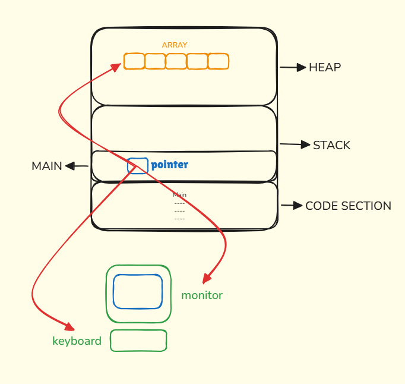

## Pointers

#### Pointers are address variables to the value;

- Pointers are used to access values outside the program, let's say we want to access files in the system. We've to use
pointers.

#### Memory
- The memory has 3 portions:
  - Code section 
  - Stack
  - Heap

- The code section can only access Stack memory. It can't access the Heap memory, to access Heap memory we need to 
use **pointers**.
- The pointers can access external values in the system, like hardware, internet, files, etc.
- 

- Pointers is used to: 
  1. Access Heap
  2. Access resources
  3. Parameters passing